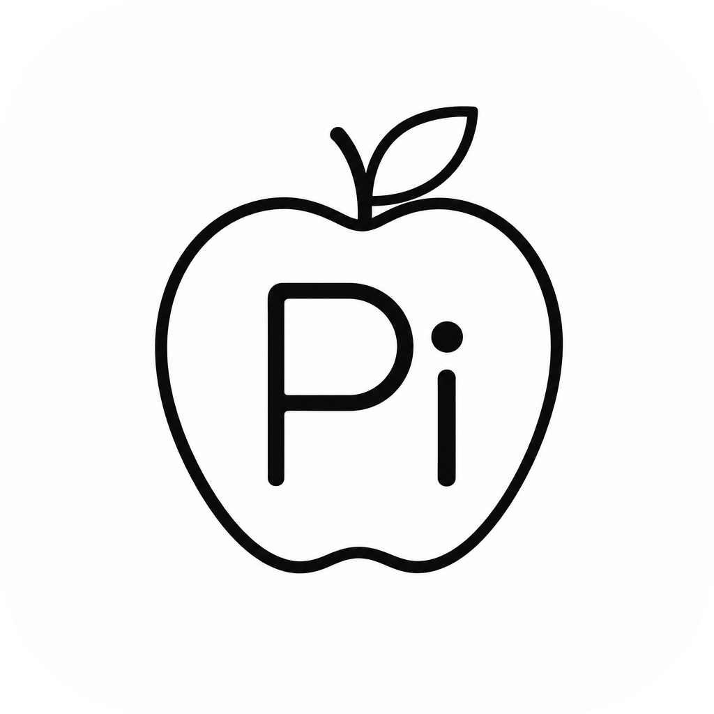
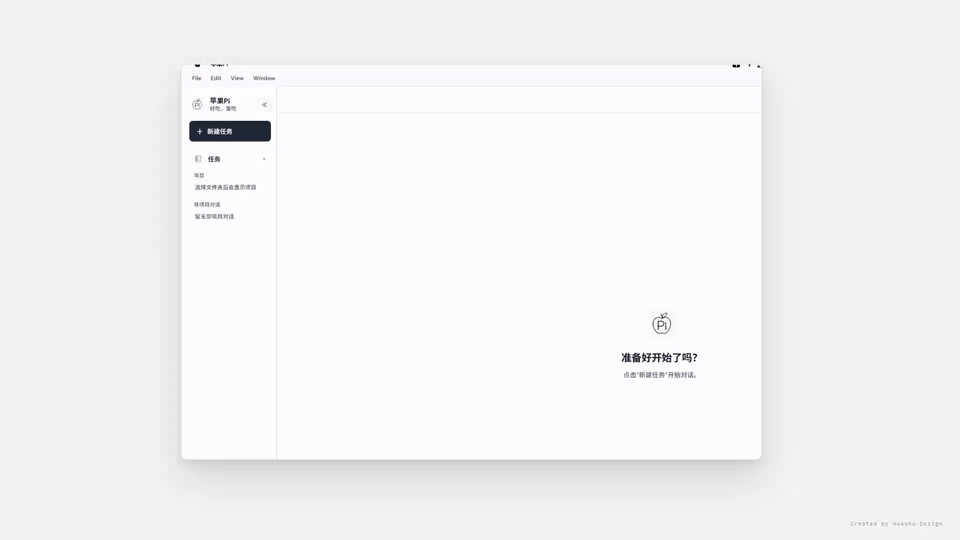
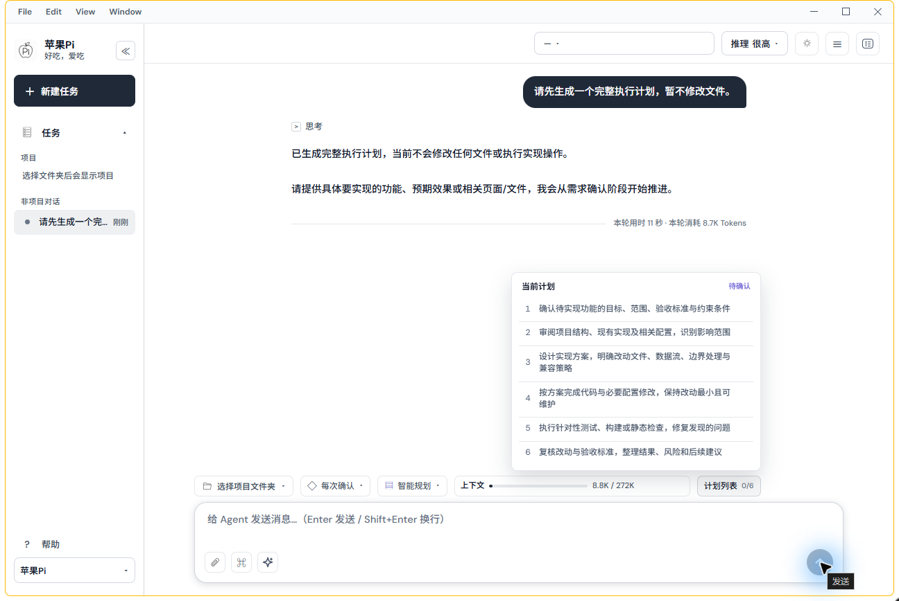
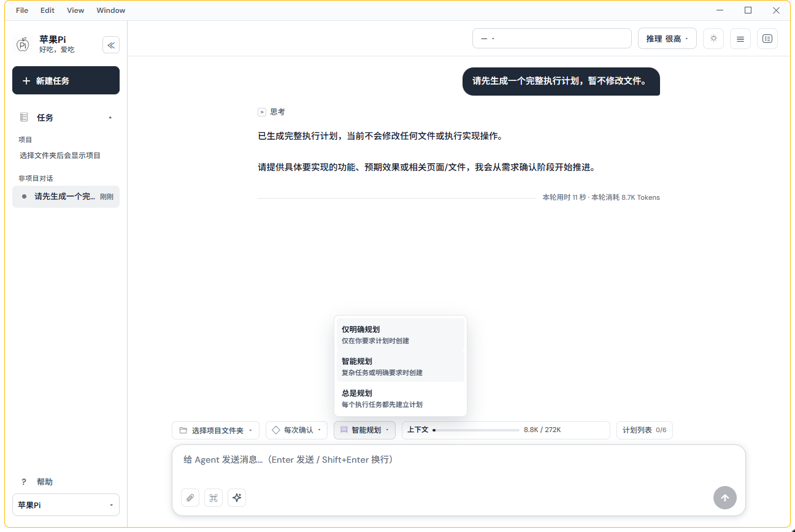

<div align="center">
  
  <h1>Apple Pi</h1>
  <p><strong>把项目上下文、执行计划、工具调用和权限边界放进同一个 Windows 桌面工作区。</strong></p>
  <p>基于开源 <a href="https://github.com/earendil-works/pi">Pi Agent</a> 构建的 Windows 桌面端 AI 编程 Agent。</p>
  <p>
    <strong>Windows 10/11 x64</strong> &nbsp;·&nbsp;
    <strong>Electron + Pi SDK</strong> &nbsp;·&nbsp;
    <strong>当前版本 1.4.4</strong>
  </p>
  <p>
    <a href="https://github.com/trrrrrryg/Apple-Pi/releases/latest">下载最新安装包</a>
    &nbsp;·&nbsp;
    <a href="#为什么是-apple-pi">为什么是 Apple Pi</a>
    &nbsp;·&nbsp;
    <a href="#从源码运行">从源码运行</a>
  </p>
</div>

<br>



<p align="center"><sub>演示来自隔离实例：任务先生成可审阅计划，再由策略和执行权限决定下一步。没有包含项目文件、会话、目录或凭证。<a href="docs/github-assets/apple-pi-workflow.mp4">下载带音轨的高清 MP4</a></sub></p>

## 为什么是 Apple Pi？

很多 Agent 软件首先是一个“能和模型聊天、也能调用工具”的入口。Apple Pi 更关注把它放回持续开发的实际工作流：**当前任务属于哪个项目、计划是否已经确认、Agent 现在能做什么、做过什么**，都应在同一个桌面窗口内看得见。

这意味着它并不把“生成代码”看成单次回答，而是把一项开发工作拆成可追溯的上下文、可审阅的计划、受权限约束的执行，以及可以回到现场的工具过程。



### 与常见桌面 Agent 形态的差异

下表比较的是产品能力的组织方式，而不是对某一个具体品牌下结论；不同 Agent 的实现和版本会有所不同。

| 关注维度 | 一般以“对话 + 工具”为中心的桌面 Agent | Apple Pi 的工作区取向 | 实际带来的变化 |
| --- | --- | --- | --- |
| 任务与项目上下文 | 对话常是主要容器，项目关联需要依赖提示词、终端位置或外部习惯保持 | 会话可按项目文件夹归档，也支持非项目对话；侧栏同时呈现项目、任务与运行状态 | 较长的任务在切换会话或重开应用后仍更容易找回上下文 |
| 长任务规划 | 计划可能仅是一段文本，或完全依赖每次提示触发 | 独立的可视化计划列表；支持“仅明确规划 / 智能规划 / 总是规划”三种策略 | 可以先审阅目标、步骤和验证方式，再决定是否开始改动 |
| 计划与执行权限 | 规划与执行状态容易混在同一轮对话或单一开关里 | 计划策略与只读、每次确认、自动执行等权限模式独立呈现 | “是否要计划”和“能否执行”是两个可见、可单独控制的决定 |
| 工具过程 | 文件、终端、网页和改动可能分散在不同窗口或外部工具中 | 工作台聚合 Git 改动审查、内置浏览器、多页签与当前项目目录下的终端 | 读结果、审改动、运行命令时不需要离开当前任务上下文 |
| 模型与扩展 | 往往绑定单一云端模型或只提供基础切换 | 内置与自定义 OpenAI 兼容厂商、推理强度、上下文窗口、多模态、本地模型运行时，以及 MCP/Skill 管理 | 能按任务、成本和本地环境选择模型与工具，而不是被单一入口锁定 |
| Windows 桌面体验 | Web 版或浏览器壳常需要自行拼接本地流程 | 中文桌面界面、项目会话管理、应用内更新和 Windows 安装包分发 | 对 Windows 开发者而言，启动、授权、设置和执行流程更连贯 |

### 一个完整任务如何流动

1. **从项目或非项目对话开始。** Apple Pi 将会话与当前文件夹关联；不属于某个仓库的研究、方案或临时问题也可以单独保存。
2. **按策略生成计划。** 对复杂任务或明确要求，智能规划会先形成计划列表；你也可以强制每个执行任务都先建立计划。
3. **确认执行边界。** 在只读、每次确认或自动执行等模式间选择。计划存在不代表已经修改文件，执行权限也不会被计划策略隐式改变。
4. **在同一工作台完成实现与验证。** 对话、工具调用、文件操作、网页检查、终端输出和 Git 改动审查保持在同一个任务现场。



<p align="center"><sub>上图是与主界面同一演示任务的真实状态：下方控件展开“仅明确规划 / 智能规划 / 总是规划”。</sub></p>

## 能力概览

| 项目与会话 | 模型与扩展 | 工作台与验证 |
| --- | --- | --- |
| 按项目文件夹归档会话，支持非项目对话、重命名、归档、删除、历史恢复与运行状态。 | 支持内置与自定义 OpenAI 兼容厂商、模型列表读取、推理强度、上下文窗口、多模态、本地模型运行时与 GPT 订阅 OAuth。 | 集成 Git 改动审查、内置浏览器、多浏览器页签，以及在当前项目目录中运行 PowerShell 或命令提示符。 |

### 开发工作流

- 可视化计划列表和上下文压缩；计划策略可设为仅明确规划、智能规划或总是规划。
- 只读、每次确认、自动执行等权限模式；计划生成和执行权限相互独立。
- 流式对话、代码块复制、文件与链接跳转、附件预览、Mermaid 图表渲染与图片导出。
- 对话与工具调用分层展示，便于查看终端、联网搜索和文件操作状态。

### MCP 与 Skill

- 首次启动时可检测并导入已有 Agent 的 MCP 与 Skill 配置。
- 可在设置中启停扩展；输入时可提示、选择并高亮已启用的 MCP 或 Skill。
- 输入框旁的 MCP 列表可快速查看服务器状态并控制启用开关。

### 本地与联网能力

- 自动检测 Ollama、LM Studio 和 llama.cpp。
- 联网搜索默认支持免费模式，也可在设置中配置个人 Tavily Key。
- 支持亮暗主题、中文界面、应用内更新与 Windows 桌面安装包分发。

## 开源基础

Apple Pi 基于开源 [Pi Agent](https://github.com/earendil-works/pi) 开发，并使用其 `@earendil-works/pi-*` 软件包提供的模型接口、Agent 循环与编程 Agent 能力。Apple Pi 在此基础上实现 Windows 桌面应用、项目与会话管理、图形界面、工作台、MCP/Skill 配置及更新分发等功能。

Pi Agent 是独立的开源项目；Apple Pi 并非 Pi Agent 官方产品，也不代表上游项目立场。

## 开始使用

1. 前往 [Releases](https://github.com/trrrrrryg/Apple-Pi/releases/latest) 下载并安装最新的 Windows 安装包。
2. 启动应用，在“设置 → 模型”配置支持的模型厂商、GPT 订阅 OAuth，或连接本地模型运行时。
3. 在输入框上方选择项目文件夹，或直接创建非项目对话；按任务需要选择规划策略和执行权限。

> 安装包适用于 Windows 10/11 x64。API Key 和 OAuth 凭证仅保存在本机受控存储中，不会写入仓库。

## 从源码运行

### 环境

- Windows 10/11
- Node.js 22 或更高版本
- npm

### 安装与启动

```powershell
git clone https://github.com/trrrrrryg/Apple-Pi.git
Set-Location .\Apple-Pi\app
npm ci
npm start
```

也可以在 Windows 下双击根目录的 `run.bat`，它会检查依赖并启动开发版本。

## 开发与测试

```powershell
Set-Location .\app
npm test                 # 单元测试
npm run dist             # 生成 Windows NSIS 安装包
```

构建产物位于 `app/dist/`，不会提交到 Git。正式安装包通过 GitHub Releases 和应用内更新服务分发。发布与更新服务的部署顺序见 [更新服务器部署说明](docs/更新服务器部署说明.md)。

## 项目结构

```text
Apple-Pi/
├─ app/
│  ├─ main/        # Electron 主进程、Pi Agent、更新与本地服务
│  ├─ preload/     # 安全 IPC 桥接层
│  ├─ renderer/    # 对话、设置和工作台界面
│  ├─ scripts/     # 测试、截图和服务器维护脚本
│  └─ test/        # 回归测试
├─ docs/           # 技术、需求、更新部署与设计文档
├─ 软件设计图/       # UI 与图标设计资源
└─ run.bat         # Windows 开发启动脚本
```

## 安全与许可证

- 不要提交 API Key、OAuth Token、`.env`、会话数据或个人项目文件。
- Agent 的工具执行应按任务选择合适的执行权限模式。
- 第三方模型、MCP、Skill 和字体资源分别遵循其自身许可证与服务条款。

本项目当前未指定开源许可证。使用、分发或二次开发前，请先联系仓库维护者确认授权范围。
